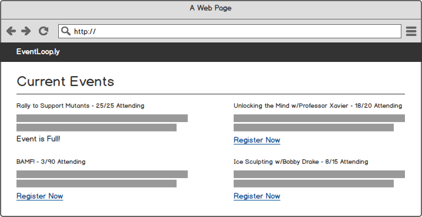
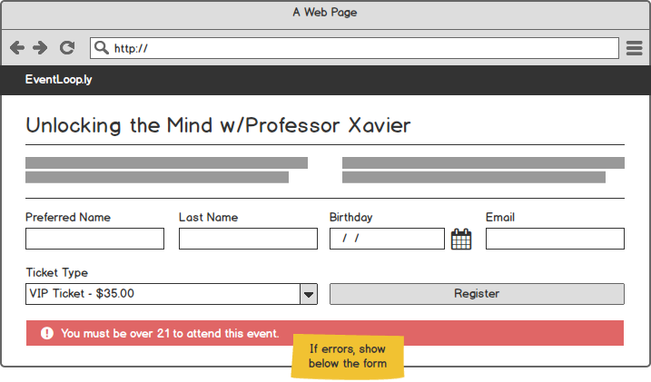
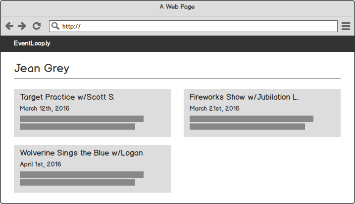
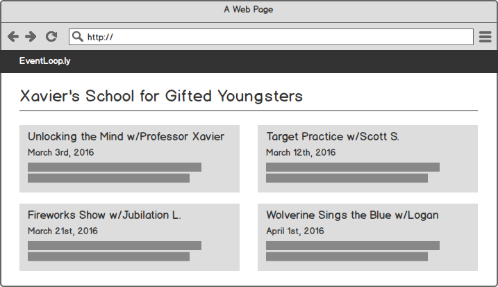
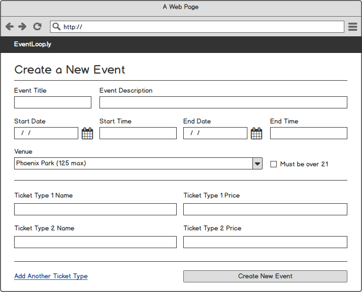

# Events CRUD

We're going to create an application that allows us to manage events.

* Create new events at different addresses
* Add attendees of different types to events
* Allow attendees to see which events they're attending

* * *

### Entry Ticket

To complete this project, you will need to understand:

* How to create a simple server via Node and Express
* How to setup a database with multiple, connected tables
* How to connect your server to your database
* How to render HTML with templates
* How to run server-side validations

* * *

### Setup

The concept behind the application and database structure is that multiple events can be held at different venues across town. Events can have different ticket types (e.g. "VIP", "Regular Admission") and attendees can buy tickets to those events.

1. Create a Node/Express application. You can roll your own or use the [Galvanize Express Generator](https://github.com/gSchool/generator-galvanize-express).

1. Create a new database called `events_crud`.

1. Create an `events` table with the following columns:
  > id, title, description, over_21, start_datetime, end_datetime

1. Create a `tickets` table with the following columns:
  > id, name, price

1. Associate events and tickets so that events can have many tickets.

1. Create a `venues` table with the following columns:
  > id, name, capacity, line_1, line_2, city, state, zip

1. Associate venues and events so that venues can have many events.

1. Create an `attendees` table with the following columns:
  > id, preferred_name, last_name, birthday, email

1. Associate attendees with events through tickets. Attendees can have many tickets and tickets can belong to many attendees.

* * *

### Routes & Pages

Your web application should create the following routes with the following constraints. Note that there is no page to create events -- you're more than welcome to create one; however, in its absence you should simply correctly seed the database with some events.

__GET '/'__

* There should be a navbar at the top with a link that allows you to get back to the homepage.
* The homepage lists all events that are occurring from today onwards. That is, it should not show past events.
* Each event listing should include a "Register Now" link that goes to the events' show page. It should also
  include the number of attendees currently going to that event out of the venue's capacity.
* If the event is full, the link should instead be text and say "Event is Full!"

__GET '/events/:id/register'__

* Displays information for the specified event. Should include all the information about the event, the venue, and any available tickets for the event.
* A form should be present where the person can type in their preferred name, last name, birthday, and email. HTML5 form validations should be present for all fields.
* There should also be a dropdown where all the ticket types for the event are shown with their price.

__POST '/events/:id/register'__

* When the form is submitted, HTML5 validations should run on all fields to make sure something is selected. The following server-side validations should run as well:
  * If the event requires attendees to be over 21 (i.e. `over_21: true`) and the attendee is under 21, an error should be returned.
  * If an email has already been used to purchase a ticket associated with that event, an error should be returned.
* If all the information passes validations, your app should:
  * Attempt to find an already existing attendee record by email; if there isn't one, create one
  * Associate the attendee and the ticket type
  * Redirect to the attendee's show page (see below)

__GET '/attendees/:id'__

* The attendee's information should show on the page.
* All the events the attendee is going to should be displayed, organized by start_datetime; information about the event should be displayed as well.

__GET '/venues/:id'__

* The venue's information should show on the page.
* All the events happening at the venue should be displayed, ordered by start_datetime; information about the event should be displayed as well.

* * *

### Stretch Goal

Create a new page to create a new event and a similar page to edit events.

__GET '/events/new'__

* A form should be present where the person can type in the event's title, description, start and end date and time, whether or not attendees must be over 21, and a dropdown box allowing the user to select a venue. HTML5 form validations should be present for all fields where it makes sense.
* Below the event information, on page load there should be two fields: Ticket Type 1 Name and Ticket Type 1 Price. If the 'Add Another Ticket Type' link is clicked, additional fields populate on the page and appropriately tick the ticket type number up by 1. When the form is submitted, new tickets should be created for the event where all information is valid.

__POST '/events'__

* When the form is submitted, HTML5 validations should run on all fields where it makes sense. The following server-side validations should run as well:
  * If the start or end date/time is in the past, an error should be returned.
  * If a Ticket Type set of fields has one blank field (for example, Ticket Type 1 Name is blank but the Ticket Type 1 Price is filled in), an error should be returned.
  * If a Ticket Type set of fields has two blank fields, it is ignored.
* If all the information passes validations, your app should:
  * Create the tickets
  * Create the event at the specified venue location
  * Associate the tickets with the newly created event
  * Redirect to the venue's show page

__GET '/events/:id/edit'__

* The same form is present for the edit page but with the correct information filled in.
* For the tickets, display the already created tickets in form fields but set them to be un-editable/disabled -- that is, you may create new Ticket Types for the event on this page but not delete them.

__PUT '/events/:id'__

* Validate the event as you've done before. If new tickets are created, correctly associate them.
